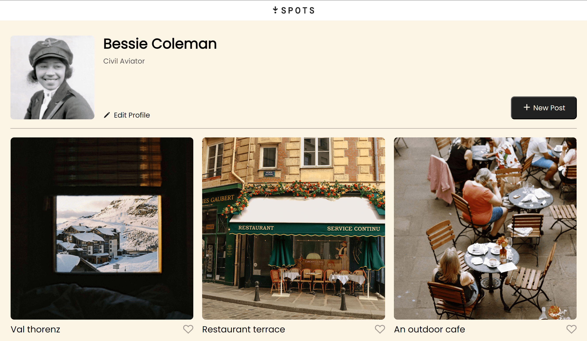
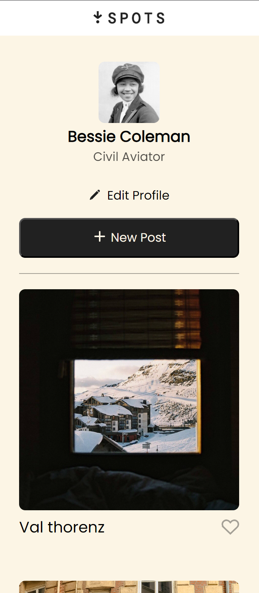

# 📸 **Spots Photo Sharing App**

## 📝 **Description**

Spots is a simple photo-sharing web application where users can upload photos, like them, and edit their profile. The current version focuses on layout and styling using **HTML and CSS**, with full **BEM methodology** applied (including a modular file structure).

Future improvements include adding **JavaScript functionality** for interactivity (likes, uploads, edits) and possibly implementing a **comments section** for photos.

---

## ⚙️ **Functionality**

- User profile section with editable details
- Photo card layout for displaying uploaded photos
- Like button UI present
- Responsive design following the BEM methodology

---

## 🛠️ **Technologies & Techniques Used**

- **Frontend:** HTML5, CSS3
- **Methodology:** Block-Element-Modifier (BEM) with strict file structure
- **Styling Tools:** normalize.css, custom fonts (vendor)
- **Design Approach:** Responsive layout, modular CSS architecture

---

## 📂 **Project Structure**

```
project-root/
│── index.html              # Main HTML file
│── /blocks                 # CSS files per block (BEM structure)
│   ├── page.css
│   ├── header.css
│   ├── nav.css
│   ├── content.css
│   ├── profile.css
│   ├── cards.css
│   ├── card.css
│   ├── footer.css
│── /images                 # Images and assets
│── /vendor                 # Vendor/fonts/normalize CSS
│   │── fonts
│   │   ├── fonts.css
│   ├── normalize.css
│── /pages                  # Page-specific CSS (e.g., index.css)
│── README.md               # Project documentation
```

---

## 📸 **Screenshots**

### 🖥️ **Desktop View**

<a href="./images/desktop_ss.png" target="_blank">
  
</a>

---

### 📱 **Mobile View**

<a href="./images/mobile__ss.png" target="_blank">
  
</a>

---

---

## 🚀 **Live Demo (GitHub Pages)**

`https://trustakaat.github.io/se_project_spots/`

---

## 🎬 **Project Pitch Video**

Check out [this video](https://drive.google.com/file/d/1JvR6snZdESYbGUp41uAQTGSeGeMste60/view?usp=sharing), where I describe my
project and some challenges I faced while building it.

---

## 🔮 **Future Improvements**

- Implement JavaScript for liking photos, uploading, and profile editing.
- Add a comments section per photo.

---

## 👤 **Author**

**James Clark**

- GitHub: [@trustakaat](https://github.com/trustakaat)

---
